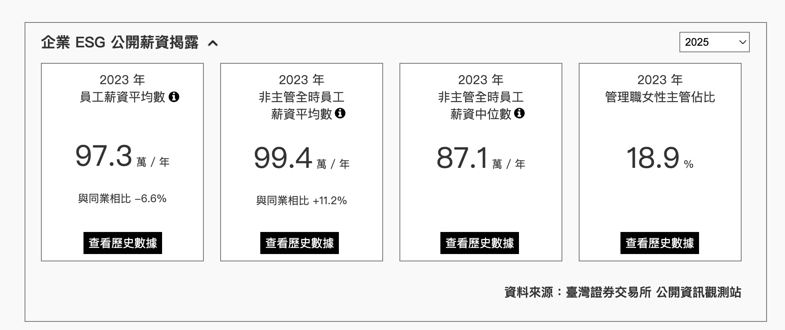

# 企業 ESG 公開薪資揭露 — 年份下拉選單 Spec

## Requirement

在公司的薪水列表頁面 (`/companies/{companyName}/salary-work-times`) 上方「企業 ESG 公開薪資揭露」區塊的右側上方，新增一個下拉選單，讓使用者可以查看不同年份的 ESG 公開資料。選單的預設值是最新年份。

## UX mockup

圖片右上方，新增下拉選單。



> 註：mockup 卡片下方的「查看歷史數據」按鈕**不在本次範圍**，視為後續獨立功能。本次只做右上角的年份下拉選單。

## Data source

- [上市公司企業 ESG 資訊揭露彙總資料-人力發展 (t187ap46_L_5)](https://openapi.twse.com.tw/#/%E5%85%AC%E5%8F%B8%E6%B2%BB%E7%90%86/get_opendata_t187ap46_L_5)
- [上市公司基本資料 (t187ap03_L)](https://openapi.twse.com.tw/#/%E5%85%AC%E5%8F%B8%E6%B2%BB%E7%90%86/get_opendata_t187ap03_L)
- [上櫃公司企業 ESG 資訊揭露彙總資料-人力發展 (t187ap46_O_5)](https://www.tpex.org.tw/openapi/#/%E5%85%AC%E5%8F%B8%E6%B2%BB%E7%90%86/get_t187ap46_O_5)
- [上櫃股票基本資料 (mopsfin_t187ap03_O)](https://www.tpex.org.tw/openapi/#/%E5%85%AC%E5%8F%B8%E6%B2%BB%E7%90%86/get_mopsfin_t187ap03_O)

## 參考 Design doc

- ESG Design doc：https://goodjoblife.atlassian.net/wiki/spaces/GJ/pages/110723074/ESG+Design+doc
- Backfill ticket：https://github.com/goodjoblife/WorkTimeSurvey-backend/issues/1276
- 2023 處理 notebook + 資料：https://github.com/goodjoblife/companyESG （`2023/`）

---

## 1. 範圍與邊界

| 項目 | 是否在本次範圍 |
|------|----------------|
| 前端：ESG 區塊右上角年份下拉選單 + 依年份篩選 | ✅ |
| 後端：backfill 2024 / 2025 ESG 資料（#1276） | ✅ |
| GraphQL schema / resolver 變更 | ❌（已支援多年份陣列，不需改） |
| mockup 上「查看歷史數據」按鈕 | ❌（後續獨立功能） |

涉及 repo：
- `GoodJobShare`（前端）
- `companyESG`（資料清洗 notebook，本機路徑 `/Users/yong/Documents/workspace/goodjoblife/companyESG`）
- `WorkTimeSurvey-backend`（插入腳本 + 本機 MongoDB）

---

## 2. 現況（為什麼後端 schema 不用改）

GraphQL 的 `Company.esgSalaryData` 四個欄位**本來就是 list**，resolver 直接回整份 MongoDB document：

```graphql
type ESGSalaryData {
  avgSalaryStatistics: [AvgSalaryStatistics!]!
  nonManagerAvgSalaryStatistics: [AvgSalaryStatistics!]!
  nonManagerMedianSalaryStatistics: [MedianSalaryStatistics!]!
  femaleManagerStatistics: [FemaleManagerStatistics!]!
}
```
（`WorkTimeSurvey-backend/src/schema/company/esgSalaryData.js`）

- MongoDB `companyESGData` collection：**每間公司一份 document**，`_id` = `canonicalCompany._id`，內含四個跨年份陣列。
- 目前每個陣列只有 **2023** 一筆。
- 前端 `TimeAndSalary/index.js` 目前只取每個陣列的 `[0]`，所以只顯示單一年份。

→ 結論：只要 (a) 後端把 2024/2025 entries 補進各公司的陣列，(b) 前端改成依選取年份篩選，即可完成需求。**GraphQL schema / resolver 完全不動。**

---

## 3. 前端設計（GoodJobShare）

### 3.1 狀態管理

- 選取年份用**元件內 local state（`useState`）**，預設為最新年份。
- **不**寫入 URL query param（與頁面其他 filter 如 `dataTime`/`experience` 不同）；重整網頁或分享連結會回到預設最新年份，此為可接受行為。
- 不影響 SSR `fetchData`、Redux、action、API。

### 3.2 資料流改動

目前 `src/components/CompanyAndJobTitle/TimeAndSalary/index.js`（約 48–56 行）把四個陣列各取 `[0]` 後以單筆 props 傳給 `EsgBlock`。改為**直接傳整包四個陣列**，年份篩選邏輯下放到 `EsgBlock` 自己擁有：

```
TimeAndSalary/index.js
  └─ <EsgBlock esgSalaryData={data} />          // 傳整包四陣列，不再取 [0]
       └─ EsgBlockRoot (EsgBlock/index.js)       // RWD 分派，props 透傳
            └─ EsgBlockDesktop / EsgBlockMobile   // {...props} 已透傳
                 └─ EsgBlock.js  ← 新增：年份 state + 下拉選單 + 篩選
```

### 3.3 `EsgBlock.js` 新增邏輯

- `availableYears`：四個陣列中出現過的所有年份取**聯集（union）**、去重、由大到小排序。
- `const [selectedYear, setSelectedYear] = useState(latestYear)`，`latestYear` = `availableYears[0]`（最大年）。
- 標題列右側新增下拉選單，重用 `src/components/common/form/Select.js`，設 `hasNullOption={false}`，options = `availableYears`。
- 每個指標依 `selectedYear` 從對應陣列 `find` 出該年 entry → 渲染 `EsgItemBlock`；該年缺資料的指標 → 該卡片不渲染（沿用現有 undefined 容錯）。
- 卡片內顯示的年份（`year`）即 entry 的 `year`，會隨選取年份變動。

### 3.4 不變動的部分

- `usePreviewed`（以「當下日曆年」為 localStorage 標記，與 ESG 資料年份無關）。
- Desktop / Mobile 的折疊、`GradientMask` 遮罩邏輯。
- SSR `fetchData`、`actions/company.js`、`apis/queryCompanyEsgSalaryData.ts`、reducer、selector。

### 3.5 型別 / PropTypes

- `EsgBlock` 改收 `esgSalaryData`（四個陣列的 shape），移除原本四個單筆 item props。
- 下拉選單 options 型別為 `{ label: number; value: number }[]`。

---

## 4. 後端設計（backfill 2024 / 2025，#1276）

採 **folder-per-year**（沿用 companyESG repo 既有 `2023/` 慣例）+ **read-all-years 整份 upsert**。

### 4.1 companyESG repo — 資料清洗（一年一 folder）

- 新增 `2024/`、`2025/` 兩個 folder，各自含：
  - 該年 OpenAPI 原始檔：`t187ap46_L_5`(上市人力發展)、`t187ap03_L`(上市基本資料)、`t187ap46_O_5`(上櫃人力發展)、`mopsfin_t187ap03_O`(上櫃基本資料)。
  - notebook（沿用 `2023/2023.ipynb` 流程）。
  - 該年 `data.json`。
- notebook 流程沿用 2023：
  1. 讀基本資料表 → 取 `stock_id`、`business_number`、`industry_code`。
  2. 讀人力發展表 → 取四個指標，單位換算（來源「仟元/人」→ `× 1000` 存「元」；百分比 `xx%` → `/100` 的 float）。
  3. 上市 + 上櫃 concat。
  4. 依 `industry_code` 分組計算**同產業平均** `sameIndustryAverage`（`avgSalaryStatistics`、`nonManagerAvgSalaryStatistics` 兩項）。
  5. 產出該年 `data.json`，每筆形狀：
     ```json
     {
       "businessNumber": "...",
       "stockId": "...",
       "stockName": "...",
       "fullStockName": "...",
       "industryCode": "...",
       "esgData": {
         "avgSalaryStatistics": [{ "year": 2024, "average": ..., "sameIndustryAverage": ... }],
         "nonManagerAvgSalaryStatistics": [{ "year": 2024, "average": ..., "sameIndustryAverage": ... }],
         "nonManagerMedianSalaryStatistics": [{ "year": 2024, "median": ... }],
         "femaleManagerStatistics": [{ "year": 2024, "percentage": ... }]
       }
     }
     ```

### 4.2 插入腳本（新寫）— read-all-years + 整份 upsert

放在 `WorkTimeSurvey-backend/scripts/`（重用既有 mongoose models）。流程：

1. 讀取**全部年份** folder 的 `data.json`（`2023/`、`2024/`、`2025/`）。
2. 以 `businessNumber` 為 key 分組，合併同一公司跨年份的 entries → 組成完整 `esgData`（四陣列各含多年）。
3. 用 `businessNumber` 查 `CanonicalCompany`（schema 有 indexed `businessNumber` 與 `companyAlias.businessNumber`）取得 `_id`。對應不到的公司記錄下來（log），略過。
4. 對 `companyESGData` 以 `_id` 做 **upsert 整份取代**（`replaceOne` / `updateOne(..., { upsert: true })`）。

> 為何整份取代而非 `$push`：每間公司一份 document、內含跨年份陣列。若用 `$push` append，重跑會產生重複年份、不 idempotent。「讀全部年份重建整份 document 再取代」可重複執行、結果穩定、本機好測。

### 4.3 對應關係（關鍵）

- `companyESGData._id === canonicalCompany._id`（resolver：`CompanyESGData.findById({ _id: canonicalCompany._id })`）。
- ESG 資料 → canonical company 的橋樑是 **`businessNumber`**。

---

## 5. 本機測試流程

1. **資料清洗**：在 `/Users/yong/Documents/workspace/goodjoblife/companyESG`，從證交所 / 櫃買 OpenAPI 下載 2024、2025 原始檔放進對應 folder，跑 notebook 產各年 `data.json`。
2. **起本機 DB**：`WorkTimeSurvey-backend` `docker-compose up mongo`（mongo:4.4, port 27017；本機 `./data/mongodb` 已有含 2023 ESG 與 canonical companies 的資料）。
3. **跑插入腳本**：執行插入腳本寫入 `companyESGData`。
4. **驗證**：打本機 GraphQL（或 mongo shell 查 `companyESGData`），確認數間公司（如台泥）三個年份的四個指標皆回得到。
5. **前端**：本機跑 GoodJobShare，確認下拉選單預設最新年、切換年份卡片更新、缺資料年份的卡片正確隱藏。

---

## 6. 測試

### 前端單元測試（`EsgBlock`）
- (a) 預設選取最新年份。
- (b) 切換年份後，卡片數值/年份對應更新。
- (c) 某指標缺選取年份的資料 → 該卡片不渲染、其他卡片正常。
- (d) 空資料 / 空陣列 → 不 crash。

### 後端
- notebook 跑完後以 GraphQL query 驗證數間公司三年份皆有資料。
- 插入腳本重複執行兩次，結果一致（idempotent，無重複年份）。

---

## 7. 已知坑與注意事項

1. **陣列順序不保證排序**：前端必須自行排序取最新，不可假設 `[0]` 是最新年。
2. **四指標年份集合可能不一致**：用聯集列入選單；缺該年的指標卡片隱藏。
3. **空白區塊**：ESG 整個 Card 容器即使某指標無資料仍會出現（現有行為）。建議只把「至少一個指標有資料」的年份列入選單，自然避免出現整年全空的選項。
4. **公司對應率**：2023 notebook 註解即指出有少數 `stock_id` 在 ESG 資料但不在基本資料；插入腳本須記錄 `businessNumber` 對應不到 canonical company 的情況並略過。
5. **單位換算**：來源為「仟元/人」，model 存「元」，前端再 `/10000` 顯示「萬」。三層換算需一致，避免重複或漏乘。
